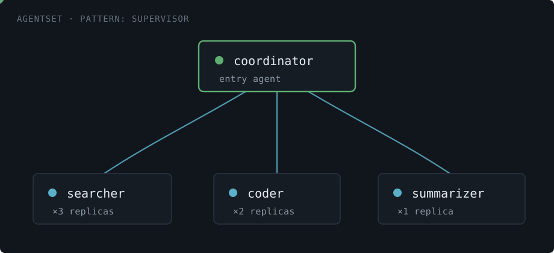
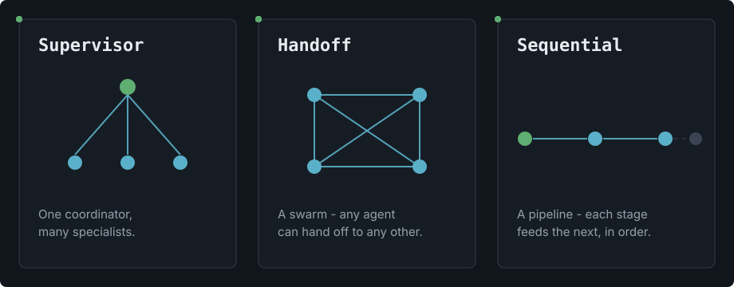

## The shift underway

AI applications are quietly re-architecting themselves three times at once - and most agent tooling was only built for the version before the shift.

The first generation of agent frameworks assumed a single model behind a single prompt. Then came multi-agent systems: a planner, a critic, a handful of specialists - each good at one thing, coordinating on a shared problem. Now a third shift is underway, and it's the one infrastructure hasn't caught up to: those agents are leaving the process. A planner and its workers used to share memory inside one Python process. Increasingly, they're separate deployments, written in different languages, scaled independently, talking over the network.

That's not a framework problem anymore. It's a Kubernetes problem - the same one that service meshes solved for microservices a decade ago, except for a workload shape nobody designed Istio or Linkerd around: agents that hold a connection open for forty seconds waiting on an LLM, that need to find each other by role instead of by hostname, and that speak a protocol - [A2A](https://a2a-protocol.org/) - most cluster tooling has never heard of.

## Every team re-solves the same problems

Pull apart a handful of production multi-agent deployments and the same scar tissue shows up in each one - usually written by whoever drew the short straw on "can you also figure out the Kubernetes side":

- **Wiring is hand-rolled.** Agent A finds Agent B through an environment variable, a config map someone edits by hand, or a URL copy-pasted between YAML files. It works until an agent is renamed or a namespace changes.
- **Autoscaling measures the wrong thing.** Kubernetes HPA works best with CPU as the metric. An agent spends most of its time blocked on an LLM call or a tool invocation - CPU idle, concurrency slot fully occupied. HPA sees a quiet replica and does nothing while requests queue behind it.
- **Rollouts drop traffic.** A plain `kubectl rollout` doesn't know an agent is mid-conversation with a caller; a naive deploy can sever a long-running A2A exchange outright.
- **The protocol has no runtime.** A2A is a wire format, not a platform. Making it actually work across languages and frameworks is left as an exercise for every team that adopts it.
- **Nothing protects the downstream.** One popular agent can be fanned out to by a dozen callers at once with no shared ceiling - and the LLM API or database behind it has no idea that's about to happen.

> [!NOTE]
> None of this is agent logic. It's plumbing - and every team is laying the same pipe, slightly differently, slightly worse, every time.

## What Kynomesh is

[Kynomesh](https://github.com/kynoproj/kynomesh) is a Kubernetes-native control plane built for this exact shape of workload. The core idea is small on purpose: declare the agents that make up your system, how they're allowed to reach each other, and which one takes the first call. Kynomesh turns that declaration into a running, self-healing fleet - each agent in its own dedicated pods, discoverable by name, talking A2A, scaled to the load it's actually under.

Everything downstream of that declaration - placement, peer discovery, scaling, safe rollouts - is the platform's job, not yours. Agent code stays agent code: plain A2A servers and clients, written against the official SDKs, in whatever language the task actually calls for.



Here's the whole declaration for a small research assistant - one coordinator delegating to a search agent, plus a third-party fraud-check agent it can call out to:

```yaml
apiVersion: kynomesh.kyno.sh/v1alpha1
kind: AgentSet
metadata:
  name: research-assistant
spec:
  pattern: Supervisor
  entry: coordinator
  agents:
    - name: coordinator
      container:
        image: my-coordinator:latest
    - name: searcher
      container:
        image: my-searcher:latest
  externalAgents:
    - name: fraud-check
      url: https://fraud-check.example.com
```

That's it. One of these agents may run in Go, another in Python; `fraud-check` isn't deployed by Kynomesh at all - it's just a URL, treated as a first-class peer anyway. None of that shows up as extra ceremony in the YAML above.

## A small vocabulary for how a team talks

Most multi-agent systems collapse into one of a handful of shapes: a coordinator delegating to specialists, a swarm where anyone can hand off to anyone, a pipeline where each stage feeds the next. Kynomesh names these patterns directly, so describing how your agents cooperate is a design decision you make once - not a peer list you hand-maintain as the team grows.



- **Supervisor** - one coordinator, many specialists. An orchestrator delegating to workers.
- **Handoff** - a swarm. Any agent can pick up work from, or hand it off to, any other.
- **Sequential** - a pipeline. Each stage hands finished work to the next, in order.

## What you stop doing

None of the pain points above are agent intelligence - they're infrastructure every team re-solves on the way to production. Kynomesh takes each one off the table:

| Before                                                      | With Kynomesh                                                  |
| ----------------------------------------------------------- | -------------------------------------------------------------- |
| Peer addresses hard-coded or hand-maintained across config  | Peers found by name, automatically, from the declared pattern  |
| Autoscaling tuned to a signal that doesn't fit the workload | Capacity learned from real traffic, not a borrowed CPU metric  |
| Deploys that hope nothing is mid-conversation               | Rollouts that let live exchanges finish before a pod goes away |
| Every language reinventing its own A2A plumbing             | A2A plumbing owned by the platform, not the agent              |
| No shared ceiling on how hard one agent gets hit            | Built-in limits that protect an agent and what it depends on   |

It all stays **Kubernetes-native** - the same `kubectl`, GitOps, and RBAC your platform team already runs, no second control plane to operate alongside it - and **language-agnostic**, so a team can mix a Go coordinator with a Python researcher without either one knowing the other exists.

## Infrastructure, not a framework you're locked into

Kynomesh deliberately stays out of agent logic. It's built on [A2A](https://a2a-protocol.org/), an open, emerging standard for agent-to-agent communication, and its SDKs are thin wrappers around the official A2A SDKs, not a replacement for them. Nothing about adopting Kynomesh asks a team to abandon the agent framework they've already built on - LangGraph, Google ADK, CrewAI, or a hand-rolled agent loop all keep working underneath.

That's a deliberate bet: the value Kynomesh adds is at the infrastructure layer - placement, discovery, scaling, rollout - not at the agent-logic layer, where teams have the most reason to want control and the least patience for lock-in.

## Get involved

Multi-agent systems are leaving the process and heading for the cluster. The question isn't whether your team builds the discovery, scaling, and rollout layer underneath them - it's whether you build it once, yourselves, per project, or declare it.

- [Docs](https://kyno.sh)
- [GitHub](https://github.com/kynoproj/kynomesh)
- [Join the Slack community](https://join.slack.com/t/kynoproj/shared_invite/zt-3zfjq4ok5-d7z2ZyeaD0574LCLXI9mnA)

Kynomesh is Apache 2.0 licensed.
